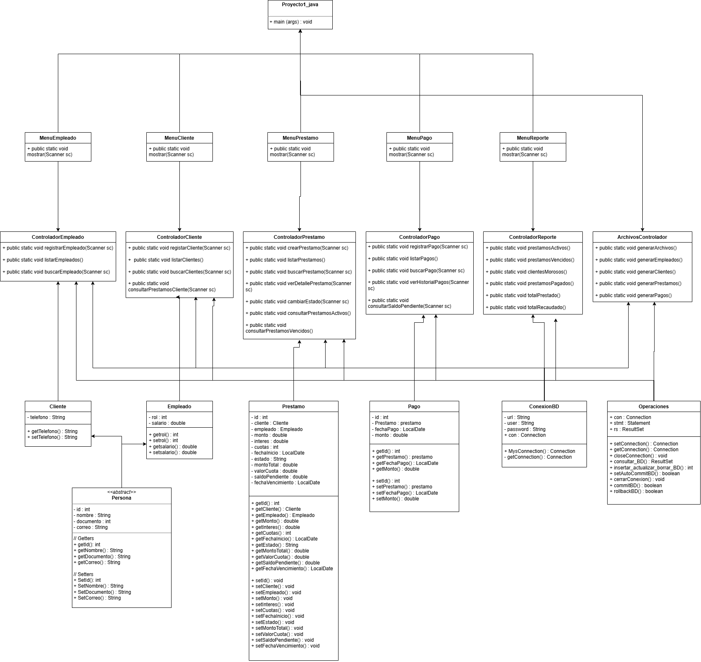

# CrediYa S.A.S.

Sistema de gestión de préstamos y pagos desarrollado en **Java** para la empresa **CrediYa S.A.S.**

El sistema permite administrar empleados, clientes, préstamos y pagos, además de generar reportes y archivos de texto con la información almacenada en la base de datos.

---

##  Descripción del proyecto

CrediYa S.A.S. es una aplicación de consola desarrollada en **Java** que permite digitalizar la gestión de créditos personales.

El sistema permite:

- Registrar empleados.
- Listar empleados.
- Buscar empleados.
- Registrar clientes.
- Listar clientes.
- Buscar clientes.
- Consultar los préstamos de un cliente.
- Crear préstamos.
- Listar préstamos.
- Buscar préstamos.
- Consultar detalles de préstamos.
- Cambiar el estado de los préstamos.
- Consultar préstamos activos.
- Consultar préstamos vencidos.
- Registrar pagos y abonos.
- Listar pagos.
- Buscar pagos.
- Consultar historial de pagos.
- Consultar saldo pendiente.
- Consultar clientes morosos.
- Consultar préstamos pagados.
- Calcular el total prestado.
- Calcular el total recaudado.
- Generar archivos `.txt`.
- Almacenar la información en MySQL.

---


#  Arquitectura del proyecto

El proyecto utiliza una estructura sencilla basada en **Vista, Controlador y Modelo**, además de un módulo de persistencia para la conexión con la base de datos.

```text
src/main/java/
│
├── Vista/
│   ├── Proyecto1_Java.java
│   ├── MenuEmpleado.java
│   ├── MenuCliente.java
│   ├── MenuPrestamo.java
│   ├── MenuPago.java
│   └── MenuReporte.java
│
├── Controlador/
│   ├── EmpleadoControlador.java
│   ├── ClienteControlador.java
│   ├── PrestamoController.java
│   ├── PagoController.java
│   ├── ReporteController.java
│   └── ArchivosControlador.java
│
└── Modelo/
    │
    ├── Clases/
    │   ├── Persona.java
    │   ├── Empleado.java
    │   ├── Cliente.java
    │   ├── Prestamo.java
    │   └── Pago.java
    │
    └── Persistencia/
        ├── ConexionBD.java
        └── Operaciones.java
```

---

#  Diagrama UML

A continuación se encuentra el espacio destinado para el diagrama de clases UML del proyecto.



---
